# Dynamic Text Changer

A professional, feature-rich Flutter application that demonstrates real-time UI updates with a focus on adaptive design, state management, and data persistence.

## 🚀 Key Features

- **Adaptive Layout**: Native feel across all devices. Uses a `BottomNavigationBar` on mobile and a `NavigationRail` on tablets or landscape mode.
- **Persistent History**: Never lose your thoughts. Save your dynamic text to a history list that persists across app restarts using `shared_preferences`.
- **State Management**: Built with the `Provider` package for clean, reactive, and scalable state handling.
- **Dark Mode Support**: Fully integrated Material 3 theme with a dedicated setting to toggle between Light and Dark modes.
- **Utility Tools**: Quick actions to **Copy to Clipboard**, **Save to History**, and **Restore** previous entries.
- **Elegant UX**: Includes a custom animated splash screen and smooth transitions.

## 🏗 Architecture: Feature-First

The project follows a scalable **Feature-First** structure, making it easy to maintain and expand:

```text
lib/
├── core/               # Shared logic, theme, and storage services
├── features/
│   ├── history/        # History list and restore logic
│   ├── navigation/     # Adaptive navigation container
│   ├── settings/       # App preferences and theme toggles
│   ├── splash/         # Entry animations
│   └── text_changer/   # Core dynamic text feature
└── app.dart            # Global configuration and provider setup
```

## 📸 Preview

### 📱 Text Changer
*Real-time text manipulation with instant UI feedback.*

| Light Mode | Dark Mode |
|:---:|:---:|
| 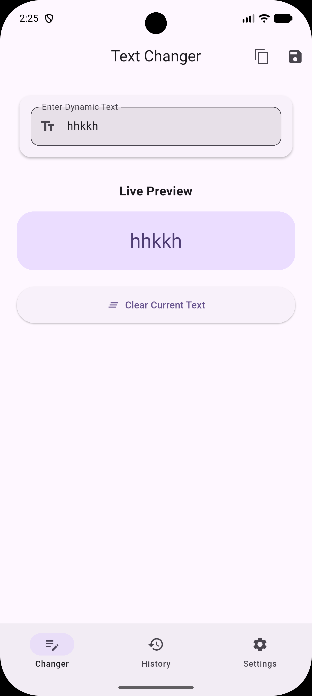 | 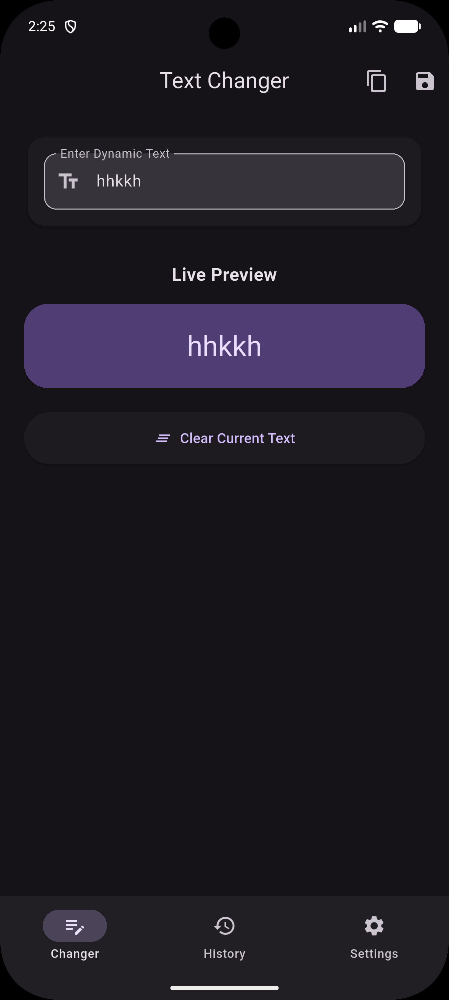 |

**Adaptive Tablet Views**
| Tablet Landscape | Tablet Portrait |
|:---:|:---:|
| 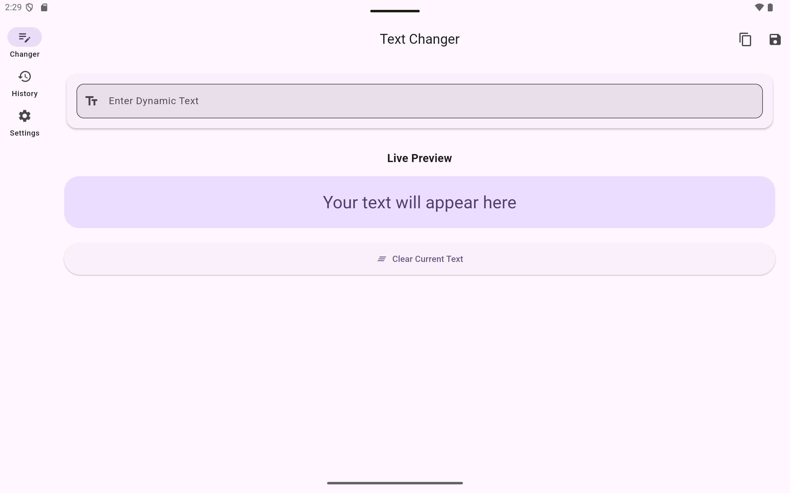 | 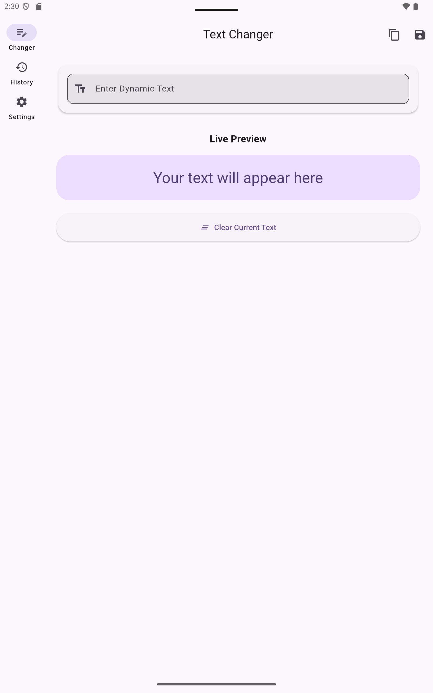 |
| *Dark Mode* | *Dark Mode* |
| 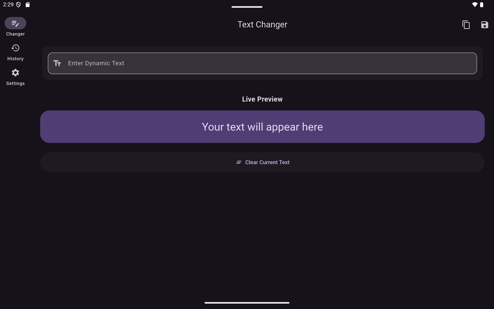 | 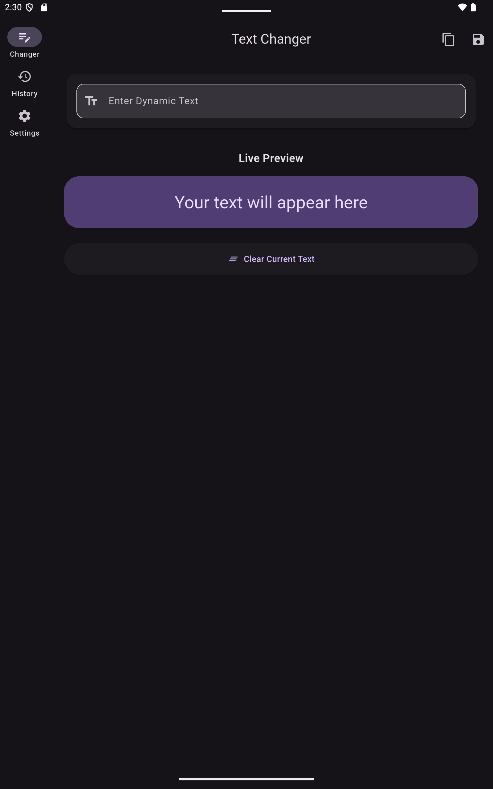 |

### 📜 History
*Persistent storage for all your text entries.*

| Mobile Light | Mobile Dark |
|:---:|:---:|
| 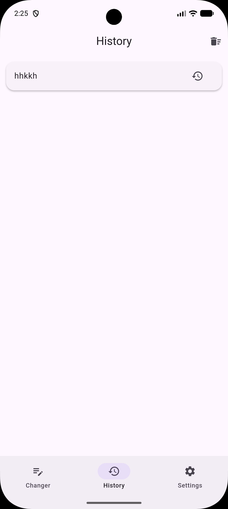 | 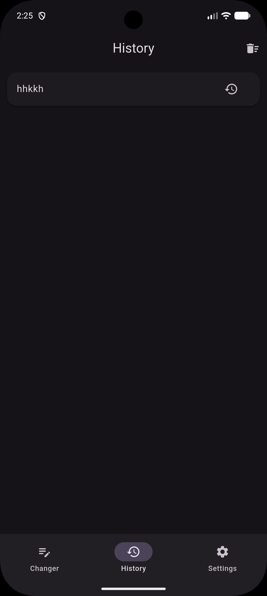 |

**Tablet History**
| Landscape | Portrait |
|:---:|:---:|
| 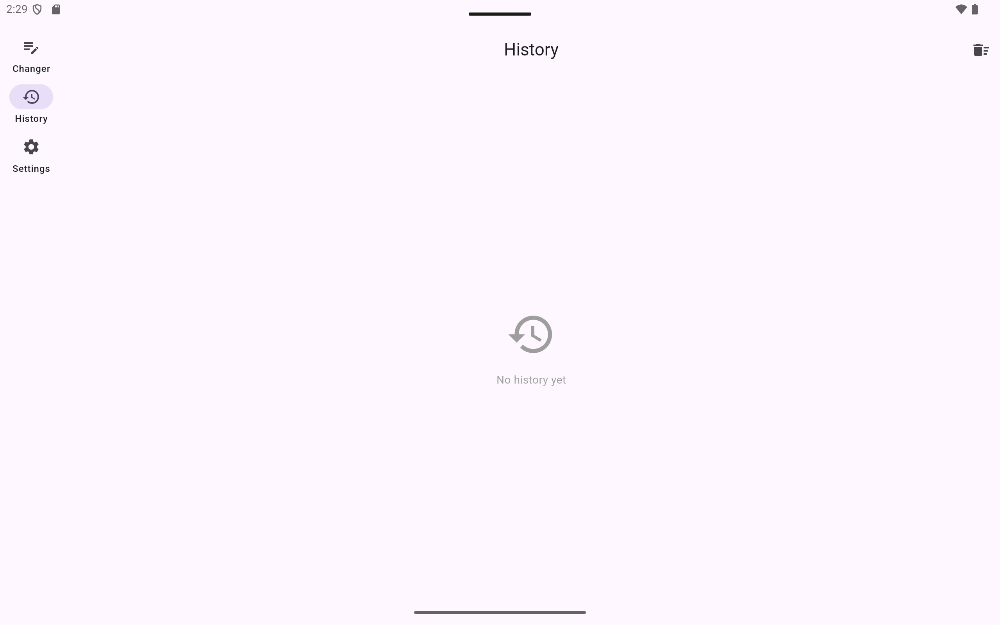 | 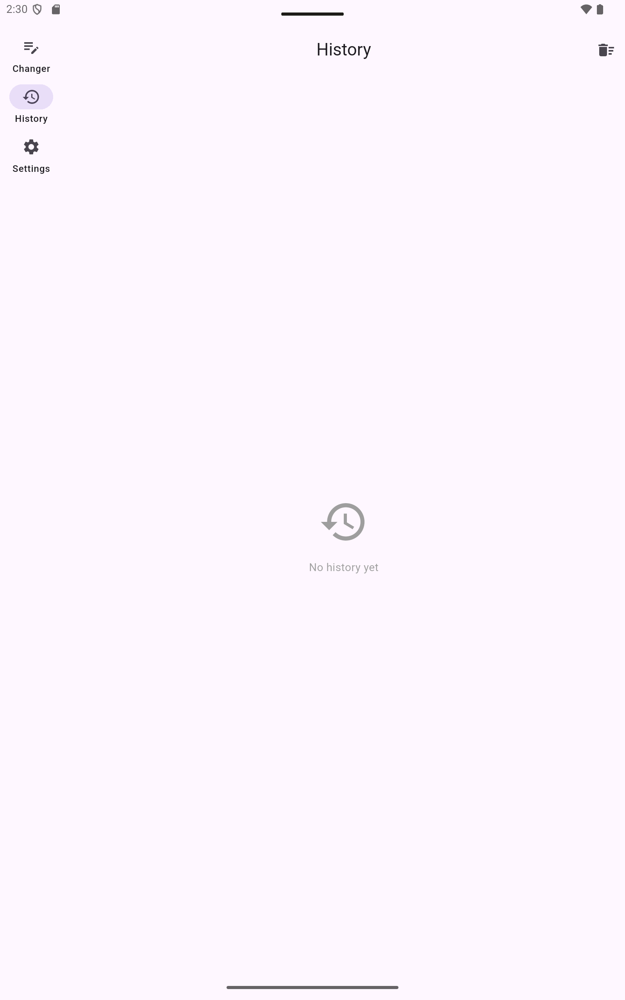 |
| 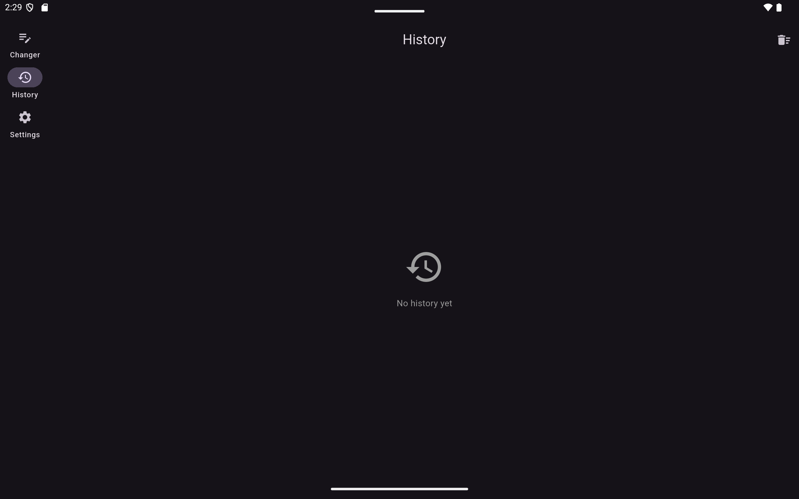 | 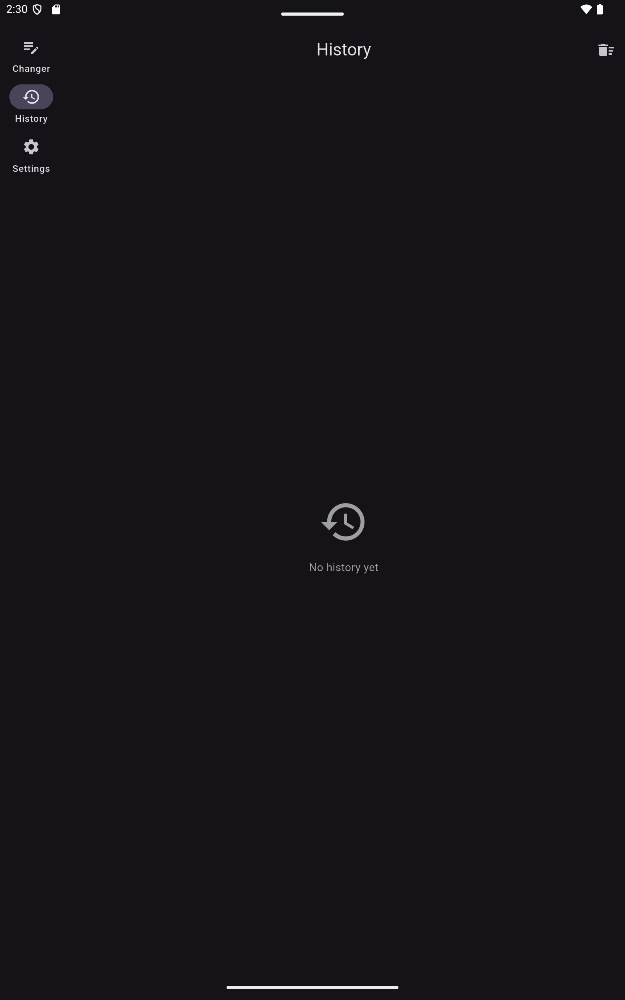 |

### ⚙️ Settings
*Customizable theme and app preferences.*

| Mobile Light | Mobile Dark |
|:---:|:---:|
| 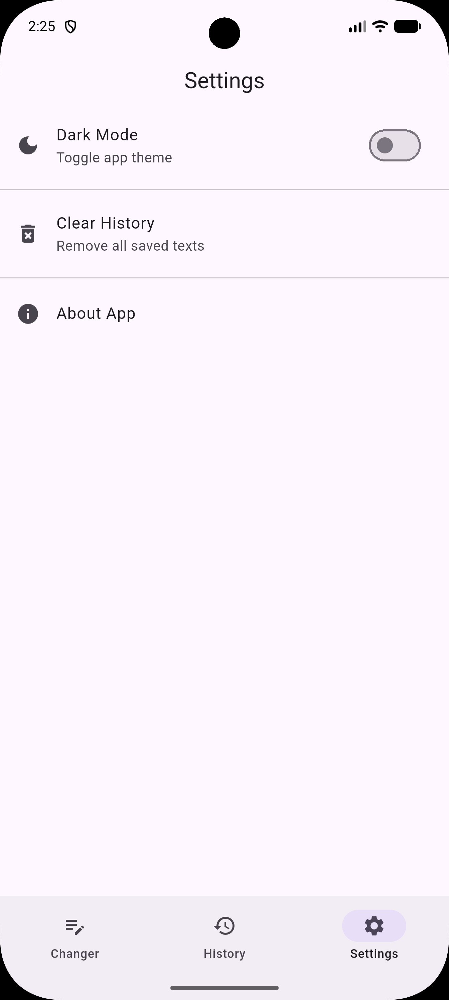 | 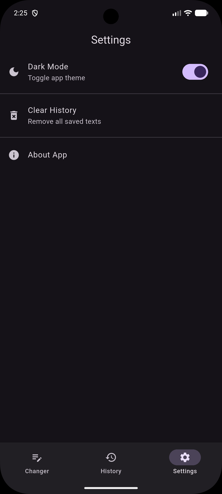 |

**Tablet Settings**
| Landscape | Portrait |
|:---:|:---:|
| 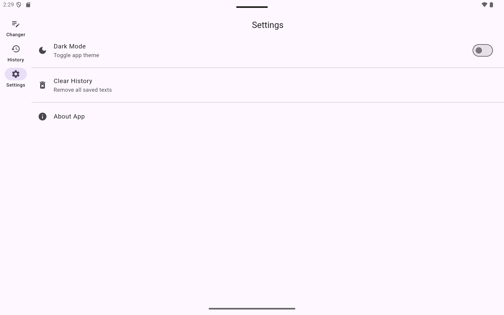 | 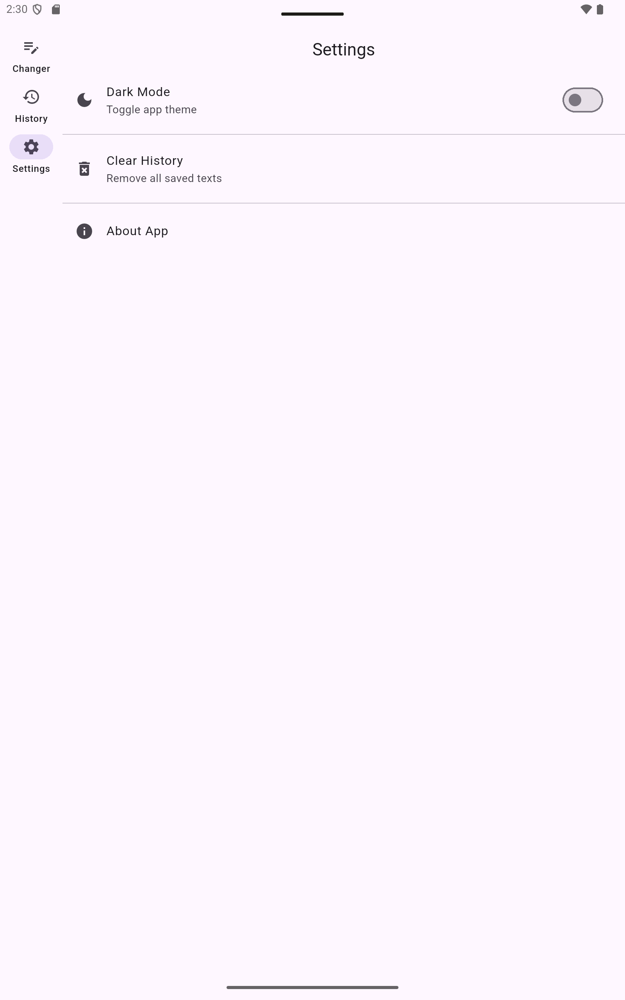 |
| 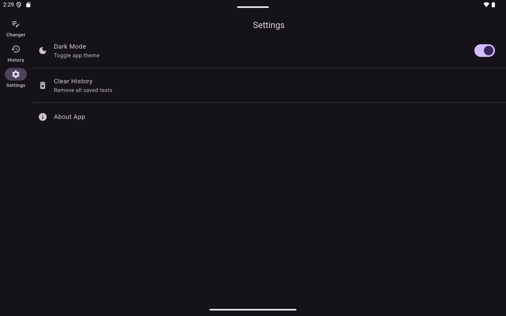 | 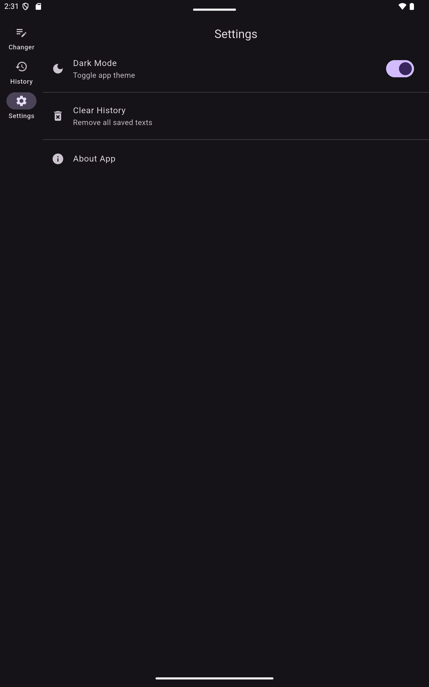 |

## 🛠 Getting Started

### Prerequisites

- Flutter SDK (^3.8.1)
- Android Studio / VS Code

### Installation

1.  Clone the repository.
2.  Install dependencies:
    ```sh
    flutter pub get
    ```
3.  Run the application:
    ```sh
    flutter run
    ```

## 🧪 Technologies Used

- **Flutter**: UI Toolkit
- **Provider**: State Management
- **Shared Preferences**: Local Persistence
- **Material 3**: Modern Design System

---

*Developed with ❤️ as a demonstration of professional Flutter development standards.*
